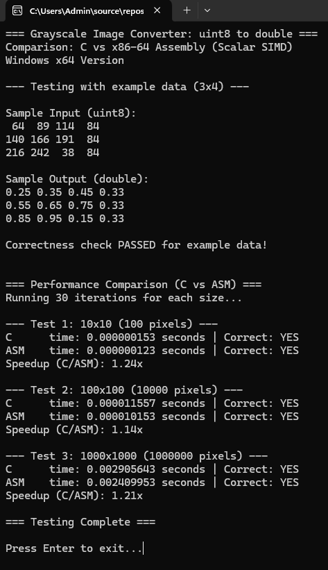

# MP2LBYARCH
Grayscale image converter (uint8 to double) using x86-64 assembly with scalar SIMD instructions. Machine Project for LBYARCH.

Converts grayscale images from 8-bit integer (0–255) to normalized float (0.0–1.0)

# Implementation
- **C**:        Handles I/O, memory, timing, and correctness checking.
- **Assembly**: Handles conversion using cvtsi2sd, divsd, movsd.
- **Formula**:  float = uint8 / 255.0

# Results

# Execution Time
10x10 image:        0.000000153 seconds
100x100 image:      0.000010153 seconds
1000x1000 image:    0.002409953 seconds

# Analysis
A similar function was implemented in C alongside the Assembly function in the code. 
Comparing the speed of their execution, the function implemented in Assembly exceeded the speed of the function implemented in pure C by a noticeable margin.
Assembly as a language seems to sacrifice readability for efficiency. 
This is a key advantage it has over higher level languages, as the speed difference becomes more significant for larger datasets.

# Video Explanation
